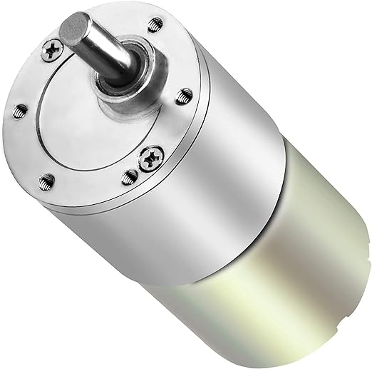
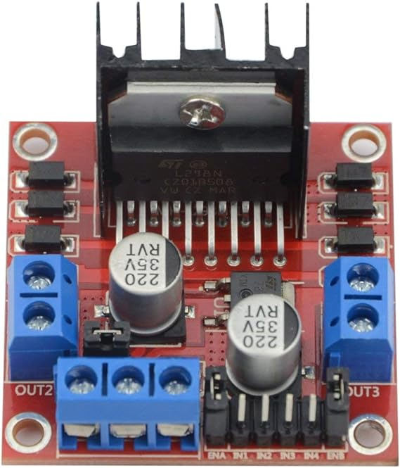
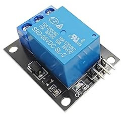
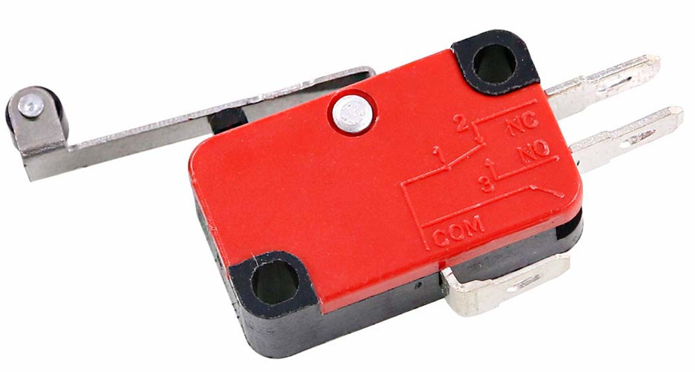

# Moteur

## Matériels nécessaires

| Photo | Description | Quantité | Lien fournisseur |
| ----- | ----------- |----------| ---------------- |
|       | Moteur à courant continue 12V avec réducteur | 1 | [Lien](https://www.amazon.fr/gp/product/B0824V7YGT/ref=ppx_yo_dt_b_asin_title_o07_s00?ie=UTF8&psc=1)|
|       | Pilote L298N de moteurs à courant continu. Permet de contrôler le moteur avec un raspberry | 1 | [Lien](https://www.amazon.fr/gp/product/B07MY33PC9/ref=ppx_yo_dt_b_asin_title_o00_s02?ie=UTF8&psc=1)|
|       | Relais 5V. Permets de couper l'arriver du courant dans le pilote du moteur et ainsi stopper le moteur | 1 | [Lien](https://www.amazon.fr/gp/product/B0C4HHBN1Z/ref=ppx_yo_dt_b_asin_title_o08_s02?ie=UTF8&psc=1)|
|       | Capteur de fin de course. Permet d'arrêter le moteur à un endroit précis | 2 | [Lien](https://www.amazon.fr/gp/product/B07SMC2QD6/ref=ppx_yo_dt_b_asin_title_o00_s00?ie=UTF8&psc=1)|

WIP

## Câblage

WIP

